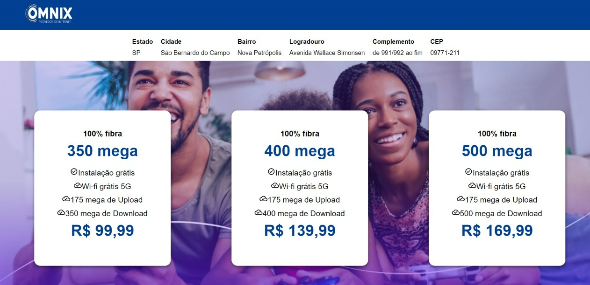

<h1 align="center">Omnix Digital Experience</h1>





## 🚀 Tecnologias

Esse projeto foi desenvolvido com as seguintes tecnologias:

- [Next](https://github.com/vercel/next.js)
- [Javascript](https://github.com/microsoft/Javascript)
- [Styled Components](https://github.com/styled-components/styled-components)
- [AuthContext](https://blog.rocketseat.com.br/autenticacao-no-react-native-reactjs-com-context-api-hooks/)

## 💻 Projeto Finalizado

Imagine que você foi contratado para desenvolver parte de uma landing page com foco na venda de planos de internet. O sistema de checkout
 já foi desenvolvido, então você deve desenvolver a página Home e de Ofertas. Ao acessar o site, o cliente se depara com uma mensagem de boas vindas
 e um formulário requisitando seu cep para prosseguir. Você deve utilizar a API da ViaCep para captar os dados do endereço. Ao avançar, é mostrada uma
 tela com uma mensagem contendo endereço informado, as ofertas dispovíveis para o cliente e um botão fixo no canto inferior direito da tela com a mensagem
 “Ops, errei meu cep!”, que, ao ser clicado, volta para a página anterior.
---

### Clonar repositório
```bash
$ git clone https://github.com/AndersonGama31/Omnix-Test.git
```

### 💻 Startar Projeto

```bash
# Vá para a pasta do projeto
$ cd IgnisFlix
# Instale as dependências
$ npm install
# Rode a aplicação
$ npm run dev
```
Acesse: http://localhost:3000/

### 📁 Páginas

- **Home:** A página inicial do site que precisa que o campo de texto seja preenchido com um CEP válido.
- **Offers:** A página apresenta os dados consumidos pela API [Via CEP](https://viacep.com.br), além de alguns cards com planos de Internet.

### ✅ Deploy do Projeto

Você pode acessar o projeto finalizado por meio deste link:

-[Omnix](https://omnix.vercel.app/)

### O projeto possui:

- Versão Desktop
- Página de Login com AUtenticação
- Token de Autenticação fica salvo nos cookies
- Consumo de API de filmes com o token
- Barra de busca dinâmica
- Botão de Ver Mais onde mais filmes são carregados
- Nome do usuário dinâmico
- Deploy no Vercel
E muito mais! 

Feito por Anderson Gama
